```mermaid
flowchart TD
    Start([Next Button Pressed]) --> CheckTurn{Is Current Player Human or Computer?}
    
    CheckTurn -->|Human Player| CheckHumanTurnComplete{Has Human Completed Turn?}
    CheckHumanTurnComplete -->|No| ShowError[Display Error: Must Complete Turn First]
    ShowError --> End([End - Wait for User])
    
    CheckHumanTurnComplete -->|Yes| HumanCommonStart[Common Actions Start]
    CheckTurn -->|Computer Player| ComputerCommonStart[Common Actions Start]
    
    HumanCommonStart --> CommonActions
    ComputerCommonStart --> CommonActions
    
    CommonActions[1. Roll Dice Generate random 1-6] --> SetRoll[2. Update Roll Display in Control Panel]
    SetRoll --> CalcTargets[3. Calculate Valid Targets Based on Roll Value]
    CalcTargets --> CheckTargets{Are There Valid Targets?}
    
    CheckTargets -->|No Targets| NoMove[4. Cannot Move Stay in Current Position]
    NoMove --> CheckInRoom{Is Player in a Room?}
    
    CheckTargets -->|Has Targets| SelectTarget{Player Type?}
    SelectTarget -->|Human| HumanSelect[5a. Human Selects Target via Mouse Click Wait for Event]
    SelectTarget -->|Computer| ComputerSelect[5b. Computer Selects Target Using selectTargets Method Prioritize Unseen Rooms]
    
    HumanSelect --> MovePlayer[6. Move Player to Selected Cell Update Board Display]
    ComputerSelect --> MovePlayer
    
    MovePlayer --> CheckInRoom
    
    CheckInRoom -->|In Room| CanSuggest{Can Make Suggestion?}
    CheckInRoom -->|Not in Room| TurnComplete[13. Mark Turn as Complete Clear Guess Fields Enable Next Button]
    
    CanSuggest -->|Yes| CheckPlayerType{Player Type?}
    CanSuggest -->|No| TurnComplete
    
    CheckPlayerType -->|Human| HumanSuggest[7a. Human Makes Suggestion via UI Dialog Select Person Weapon Room is Current Room]
    CheckPlayerType -->|Computer| ComputerSuggest[7b. Computer Makes Suggestion Using createSuggestion Method Select Unseen Person Weapon Room is Current Room]
    
    HumanSuggest --> ProcessSuggestion[8. Process Suggestion Call handleSuggestion]
    ComputerSuggest --> ProcessSuggestion
    
    ProcessSuggestion --> QueryPlayers[9. Query Players in Order Starting After Accuser Check Each Players Hand]
    QueryPlayers --> CheckDisproof{Did Any Player Disprove?}
    
    CheckDisproof -->|Yes| ShowDisproof[10. Display Disproof Card Show Card Name Update Guess Result Field]
    CheckDisproof -->|No| ShowNoDisproof[11. No One Could Disprove Display No one could disprove Update Guess Result Field]
    
    ShowDisproof --> UpdateSeenCards{Is Current Player Computer?}
    ShowNoDisproof --> UpdateSeenCards
    
    UpdateSeenCards -->|Yes| AddToSeen[12. Add Shown Card to Computer Players Seen List updateSeen Method]
    UpdateSeenCards -->|No| TurnComplete
    
    AddToSeen --> TurnComplete
    
    TurnComplete --> NextPlayer[14. Move to Next Player Increment Player Index Wrap Around if Needed]
    
    NextPlayer --> UpdateDisplay[15. Update Control Panel Set Current Player Name Set Player Color Clear Roll Field]
    
    UpdateDisplay --> CheckNextPlayerType{Next Player Type?}
    
    CheckNextPlayerType -->|Human| EnableHumanControls[16a. Enable Human Controls Enable Target Selection Enable Suggestion Button Disable Next Button]
    CheckNextPlayerType -->|Computer| DisableControls[16b. Disable All Controls Disable Next Button Auto-Process Computer Turn]
    
    EnableHumanControls --> WaitHumanTurn[17a. Wait for Human Actions Event-Driven Target Selection Suggestion Creation Turn Completion]
    DisableControls --> AutoComputerTurn[17b. Auto-Execute Computer Turn Select Target Make Suggestion Process Results]
    
    AutoComputerTurn --> EnableNextButton[18. Enable Next Button Ready for Next Turn]
    WaitHumanTurn --> EnableNextButton
    
    EnableNextButton --> End
    
    classDef humanAction fill:#e1f5ff,stroke:#01579b,stroke-width:2px
    classDef computerAction fill:#fff3e0,stroke:#e65100,stroke-width:2px
    classDef commonAction fill:#f3e5f5,stroke:#4a148c,stroke-width:2px
    classDef decision fill:#fff9c4,stroke:#f57f17,stroke-width:2px
    classDef endNode fill:#c8e6c9,stroke:#1b5e20,stroke-width:2px
    
    class HumanSelect,HumanSuggest,EnableHumanControls,WaitHumanTurn humanAction
    class ComputerSelect,ComputerSuggest,AddToSeen,DisableControls,AutoComputerTurn computerAction
    class CommonActions,SetRoll,CalcTargets,MovePlayer,ProcessSuggestion,QueryPlayers,ShowDisproof,ShowNoDisproof,TurnComplete,NextPlayer,UpdateDisplay commonAction
    class CheckTurn,CheckHumanTurnComplete,CheckTargets,SelectTarget,CheckInRoom,CanSuggest,CheckPlayerType,CheckDisproof,UpdateSeenCards,CheckNextPlayerType decision
    class Start,End endNode
```

## Flowchart Summary

**What happens when Next! button is pressed:**

### For Human Players:
1. Check if human has completed their turn (moved and made suggestion if required)
2. If not complete, show error and wait
3. If complete, proceed to next player

### For Computer Players:
1. Automatically execute turn without user interaction

### Common Actions (Both Player Types):
- **Roll dice** (1-6)
- **Calculate targets** based on roll
- **Move player** (human clicks, computer auto-selects)
- **Make suggestion** if in room (human via dialog, computer auto-generates)
- **Process suggestion** through all players
- **Update displays** and move to next player

### Game Rules Enforced:
- Human must finish turn before Next works
- Only valid targets can be selected
- Suggestions only in rooms
- Computer prioritizes unseen rooms
- Computer tracks seen cards
- Event-driven for humans (no loops)

**Total: 18 detailed steps covering both player types**
